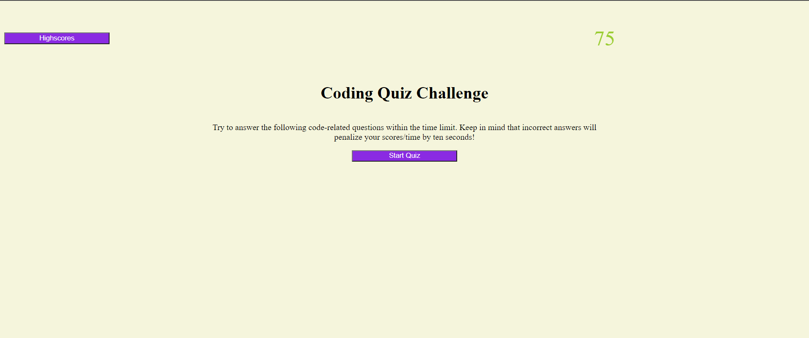

# Portfolio

## Purpose
Allow user to take a dynamically generated quiz and receive a score based on how well/quickly the complete it.

## Features
* timer that counts down once you start the quiz
* text indication of whether your selected answer is correct or incorrect
* timer is decreased when you give an incorrect answer
* on quiz completion or when you run out of time, brings you to a submit score screen
* submitting score saves it to localstorage if it was in the top 10 scores, then shows the highscores

## Built with
* HTML
* CSS
* JavaScript

## Website 
https://matt11711.github.io/Coding-Test/

## Contribution
Made with ❤️ by Matt11711